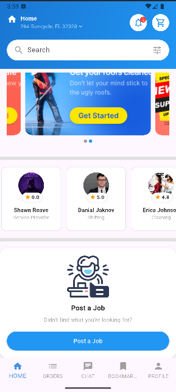

# 🛠️ Service Marketplace App

A modern Flutter application for browsing service providers, viewing service categories, promotional banners, and posting jobs. Built with clean UI/UX and API integration.

---

## 🚀 Features

- 🔍 Search and filter services  
- 🧑‍🔧 View popular service providers with ratings  
- 🗂️ Browse service categories with icons  
- 🖼️ Auto-sliding promotional banner carousel  
- 🧾 “Post a Job” call-to-action card  
- 📦 Real-time data via REST API integration  

---

## 📱 Screenshots

 
 

---

## 🧰 Tech Stack

- **Framework:** Flutter (Material 3)  
- **Language:** Dart  
- **Packages Used:**  
  - `http` – for API requests  
  - `carousel_slider` – for banner carousel  
  - `flutter/material.dart` – native UI components  

---

## 🛠️ Setup Instructions

### 1. Clone the repository

```bash
git clone https://github.com/your-username/service_marketplace_app.git
cd service_marketplace_app

flutter pub get
flutter run
```

---

## 🔗 API Endpoints Used

- `GET /api/v1/categories` – fetch all service categories  
- `GET /api/v1/provider-lists` – fetch all providers with ratings and services  
- `GET /api/v1/slider-lists` – fetch banner slider images  

> **API Base:** `https://prohandy.xgenious.com`

---

## 🧪 Notes

- All network calls are handled using the `http` package with error handling.  
- The UI components are modular and follow a clean component-based structure.  
- Placeholder assets should be placed under `assets/` and linked in `AssetPaths`.

---

## 📄 License

This project is **open-source** and free to use for educational or demo purposes.

---

## 💡 Author

Developed by **Md. Rashedul Islam**

If you found this helpful, give it a ⭐ on GitHub!
